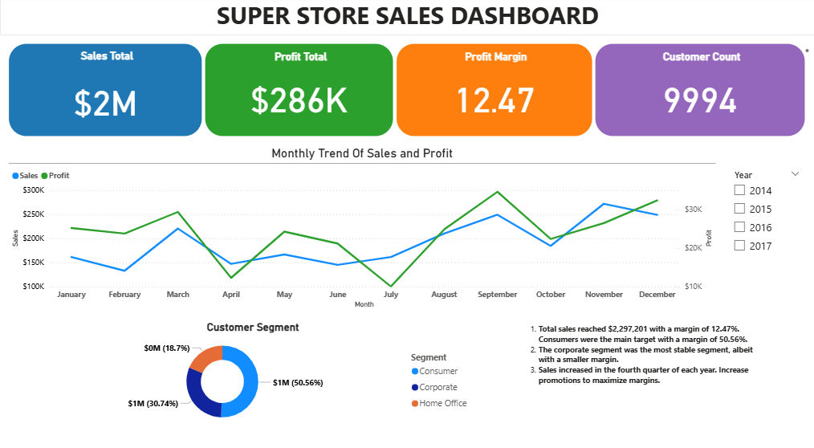
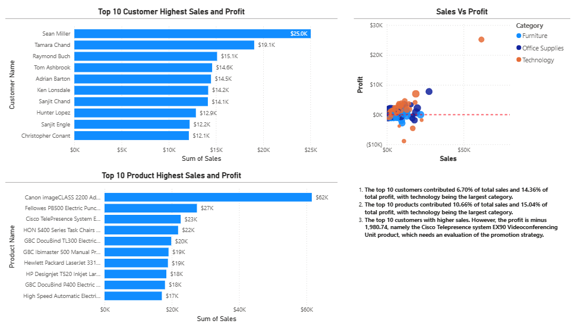
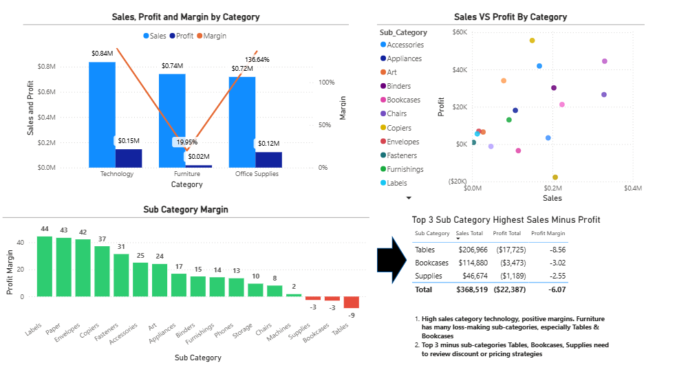
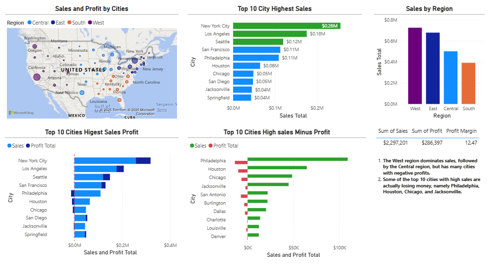
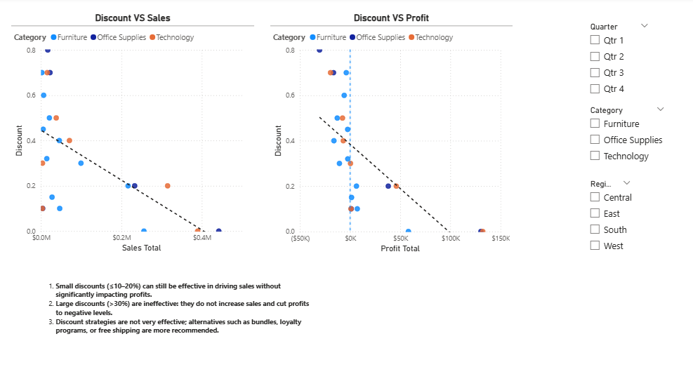

# Super Store Data Analysis

## Project Overview
Analisis performa penjualan & profit menggunakan dataset [Superstore](https://www.kaggle.com/datasets/vivek468/superstore-dataset-final) yang berfokus pada :
* Sales & Revenue trend analysis
* Profitability & Margin evaluation
* Customer & Product performance
* Geographic market insights
* Discount impact on profitability

## Business Objective
Menganalisis data penjualan untuk:
1. Mengidentifikasi kota, kategori, dan customer yang berkontribusi paling besar terhadap sales & profit.
2. Menemukan area yang menghasilkan sales tinggi namun profit negatif (red flag → potensi strategi pricing/promosi salah).
3. Mengevaluasi pengaruh discount terhadap sales & profit margin → untuk menemukan titik optimal diskon.
4. Memberikan insight strategis untuk keputusan bisnis: alokasi promosi, targeting customer, dan efisiensi produk.

## Tools & Workflow
1. Tools
* Python (Pandas, NumPy, Matplotlib) → Data cleaning & preprocessing.
* Power BI → Dashboard interaktif & visualisasi.
* SQL (opsional, untuk data query).

2. Workflow
* Data Preparation → cleaning, handling missing values, converting datatypes.
* Exploratory Analysis → tren sales, analisis Costumer, Produk dan Geografis.
* Dashboard Development → Power BI visual untuk KPI, customer, product, geography, dan discount.
* Insights Generation → rekomendasi berbasis data.

## key Insights
* Sales dan Profit KPI
Total Sales: $2.3M | Profit: $286K | Avg Margin: 12.5%, Sales dan profit terbesar ada pada Q4 dan Segmen Consumer mendominasi sales menjadi peluang loyalty program.
* Customer & Product Performance
Top 10 customers menyumbang >30% sales dan Produk kategori Furniture memiliki sales tinggi tapi margin tipis perlu review harga, biaya distribusi dan lainnya.
* Category & Subcategory
Kategori Technology menjadi penyumbang Margin Terbesar sedangkan funiture memiliki beberapa sub kategori yang menyebabkan kerugian pada margin(sub kategoti tables dan bookcase)
* Geographic Insights
New York & Los Angeles menjadi kota dengan sales tertinggi dan profit yanf sehat sedangkan Philadelphia, Houston, Chicago terkategorikan sales tinggi tapi profit minus perlu dilakukan strategi diskon/promosi harus ditinjau ulang.
* Discount Analysis
Diskon 20–30% masih meningkatkan sales, tapi profit mulai turun. Diskon >30% → tidak efektif menaikkan sales, malah profit turun drastis.

## Dashboard Preview

## Business Recommendation
1. Tingkatkan Promosi untuk Q4 agar memaksimalkan sales 
2. Optimalkan strategi diskon: batasi di bawah 30% kecuali untuk clearance stock.
3. Review kategori Furniture Sub kategori Tables karena menyumbang rugi besar.
4. Targetkan kota dengan high sales but low profit dengan strategi pricing baru.
5. Fokus pada customer high-value untuk program loyalitas.
