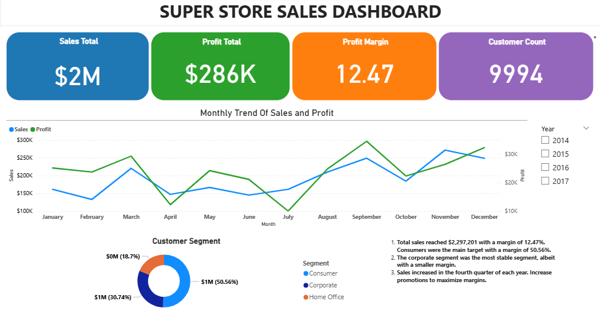
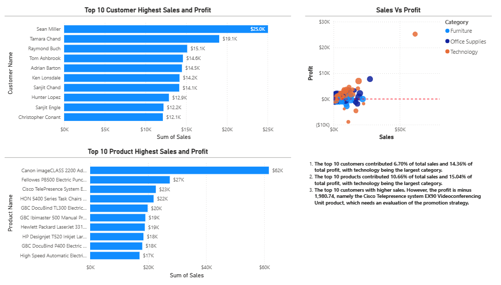
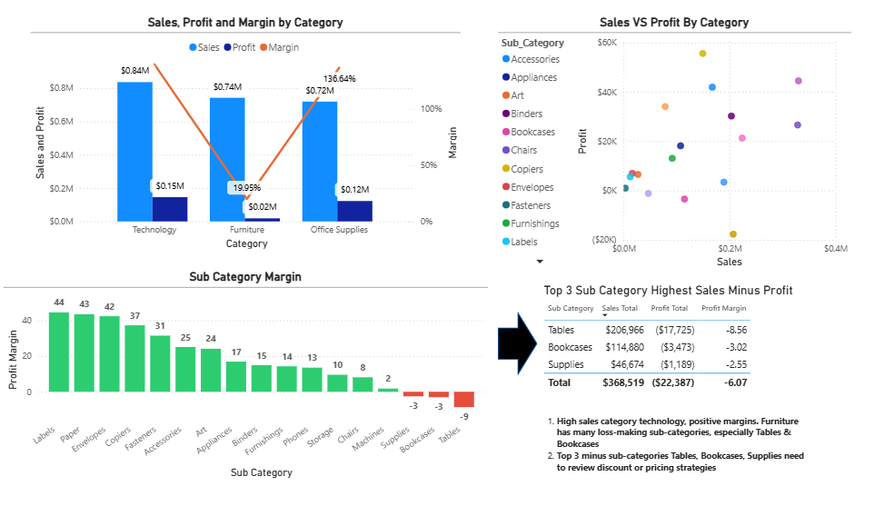
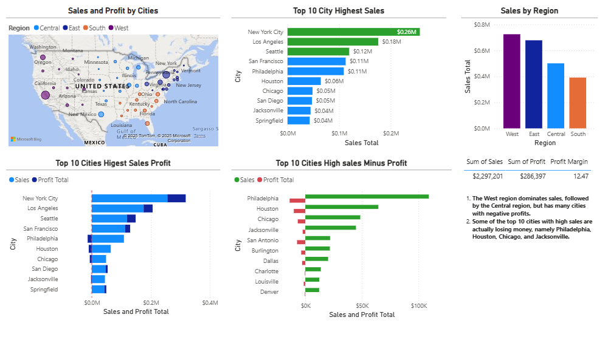
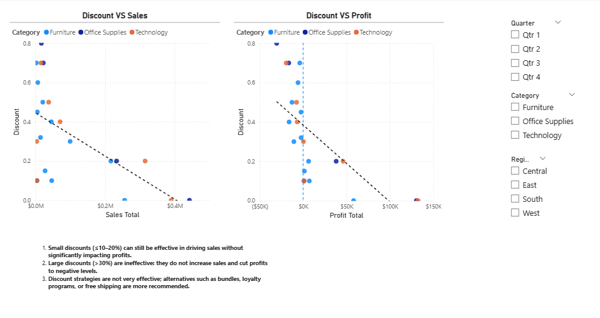

# Super Store Data Analysis

## Project Overview
Sales and profit performance analysis using the [Superstore](https://www.kaggle.com/datasets/vivek468/superstore-dataset-final) dataset, focusing on:
* Sales and revenue trend analysis
* Profitability and margin evaluation
* Customer and product performance
* Geographic market insights
* Discount impact on profitability

## Business Objective
Analyze sales data to:
1. Identify cities, categories, and customers that contribute most to sales & profit.
2. Find areas that generate high sales but negative profits (red flag → potential pricing/promotion strategy error).
3. Evaluate the impact of discounts on sales & profit margins → to find the optimal discount point.
4. Provide strategic insights for business decisions: promotion allocation, customer targeting, and product efficiency.

## Tools & Workflow
1. Tools
* Python (Pandas, NumPy, Matplotlib) → Data cleaning & preprocessing.
* Power BI → Interactive dashboard & visualization.
* SQL (optional, for data queries).

2. Workflow
* Data Preparation → cleaning, handling missing values, converting data types.
* Exploratory Analysis → sales trends, customer, product, and geographic analysis.
* Dashboard Development → Power BI visuals for KPIs, customers, products, geography, and discounts.
* Insights Generation → data-driven recommendations.

## key Insights
* Sales and Profit KPI
Total Sales: $2.3M | Profit: $286K | Avg Margin: 12.5%, Q4 saw the highest sales and profit, and the Consumer segment dominated sales, presenting an opportunity for a loyalty program.
* Customer & Product Performance
The top 10 customers contributed >30% of sales, and furniture products had high sales but low margins, requiring a review of prices, distribution costs, and other factors.
* Category & Subcategory
The Technology category contributes the largest margin, while Furniture has several subcategories that cause margin losses (subcategories: tables and bookcases).
* Geographic Insights
New York and Los Angeles are the cities with the highest sales and healthy profits, while Philadelphia, Houston, and Chicago are categorized as having high sales but negative profits, requiring a review of discount/promotion strategies.
* Discount Analysis
Discounts of 20–30% still increase sales, but profits begin to decline. Discounts >30% → ineffective in increasing sales, and profits decline dramatically.

## Dashboard Preview

## Business Recommendation
1. Increase promotions for Q4 to maximize sales.
2. Optimize discount strategies: limit discounts to below 30% except for clearance stock.
3. Review the Furniture subcategory Tables as it contributes significantly to losses.
4. Target cities with high sales but low profits with new pricing strategies.
5. Focus on high-value customers for loyalty programs.
